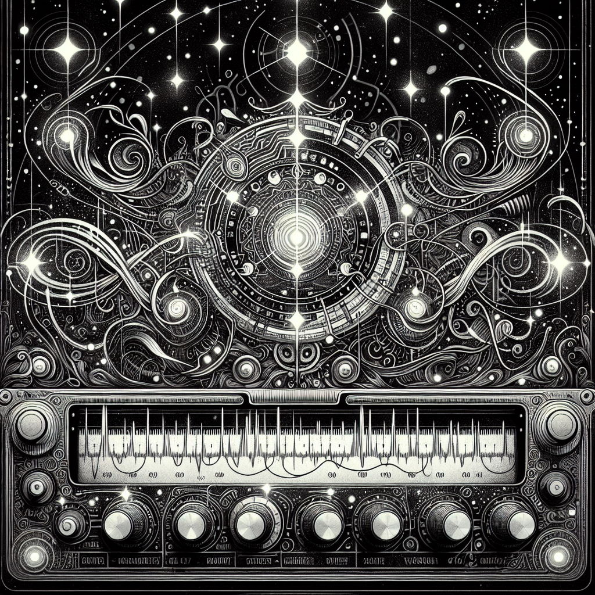

# Timbre Graph Plugin

A [Signals & Sorcery](https://signalsandsorcery.com) plugin for **sound exploration** — six Surge XT tracks behave as one instrument, so a single dial reshapes the whole ensemble at once and you go hunting for a sound instead of programming one.

<p align="center">
  
</p>

> Part of the **[Signals & Sorcery](https://signalsandsorcery.com)** ecosystem.

## What it does

Six fixed layers — Kick, Snare, Hat, Bass, Chord Pad, Lead — each on its own Surge XT track, each starting from a factory patch you already like.

- **One dial moves all six.** Turn it and every synth changes together, each in its own way: what reads as a longer tail on the snare might be an envelope shift on the pad and a filter move on the bass.
- **Nothing is labelled at the point of use.** You sweep, you listen, you stop when it sounds good. It is a search surface, not a parameter editor.
- **Unlink any track.** Love the pad you just found? Freeze it and keep hunting with the other five. Unlinked tracks hold exactly where you left them.
- **Every position is a real patch.** Stop anywhere and you have six ordinary Surge patches you can keep, tweak by hand, or use separately.
- **MIDI is never touched.** Notes, timing, velocity and arrangement are yours alone — this only ever changes sound.
- **Tracks that cannot follow hold still.** A short kick has almost no brightness to give; rather than invent a change, it stays put and says so.

## How it works

The dial is not a macro mapped to knobs, and nothing about the sound is guessed. The plugin plays back a **morph graph** — a small file, built ahead of time, that stores six real Surge patches for every position on the dial.

**1. Each patch is measured.** For a chosen anchor, the lab renders it through a short role-specific MIDI probe, then nudges each live-safe continuous parameter up and down and re-renders. Comparing those renders gives a *response matrix*: how this exact patch's sound moves when each control moves. Rendering runs about 100× faster than real time, so measuring six patches takes seconds.

**2. Sound is described numerically.** Every render is reduced to 20 perceptual descriptors — spectral centroid, bandwidth, rolloff, band energies, flatness, attack time, decay slope, crest factor, envelope sparsity, loudness and others. Descriptors are compared in standardised units so band balance and envelope shape count as much as spectral brightness, and timbre is measured on loudness-normalised audio with loudness kept as its own separate dimension — so "morphing" can never quietly become "turning it up".

**3. A direction is chosen in that space.** Axes are named and musical — *brighter*, *fuller*, *wider*, *longer*, *boomier*, *tighter*, *punchier*, *softer*, *rougher*. An axis means the same thing for every layer, but each layer reaches it with whatever parameters it actually has.

**4. Each synth is solved, then searched.** The response matrix gives a first guess at the parameter move that travels along the axis: a damped minimum-norm least-squares step, so the answer is the *smallest* change that gets there and the patch keeps its identity. Because synth controls interact, that guess is then refined against **real renders** — a short search that measures instead of assuming.

**5. The result is verified and stored.** The dial is walked outward from the centre in small steps, each one rendered and scored for whether it truly moved along the requested axis, how far the parameters travelled, and whether neighbouring positions stay close enough to feel continuous. Positions a patch cannot reach are recorded as *holding*.

At runtime the panel does one thing: **interpolate between two verified snapshots.** No model, no solver, no inference — so the dial is instant and every point on it is a sound that was actually rendered and checked.

There is also a **two-axis pad**: two axes solved independently and combined, with each corner re-rendered so the file records how well the combination held for each patch.

## Building a morph graph

The plugin consumes an artifact produced by the training lab in [`training/`](training/):

```bash
cd training
uv venv --python 3.11 .venv && uv pip install -e ".[dev]" --python .venv/bin/python

.venv/bin/tglab inventory      # scan installed Surge patches, assign roles
.venv/bin/tglab policy         # discover live-safe continuous parameters
.venv/bin/tglab probe          # measure one anchor per role
.venv/bin/tglab axes           # which axes each patch can express
.venv/bin/tglab morph --axis softer
```

Full reference, including the measurement conventions and quality gates: [`docs/TRAINING.md`](docs/TRAINING.md).

## Install

From within Signals & Sorcery: **Settings > Manage Plugins > Add Plugin** and enter:

```
https://github.com/shiehn/sas-timbre-graph
```

Or clone manually into `~/.signals-and-sorcery/plugins/@signalsandsorcery/timbre-graph/`.

Ships **disabled by default** — the panel needs a morph graph, so enable it once you have built one.

## Capabilities

| Capability | Required |
|------------|----------|
| `requiresLLM` | No — nothing here is generated by a language model |
| `requiresSurgeXT` | Yes — six Surge XT instances, and rendering to measure them |

## Development

```bash
npm install
npm test         # panel + interpolation + registration surface
npm run build    # tsup -> dist/ (the app consumes the built dist)

cd training && .venv/bin/python -m pytest tests/ -q   # the measurement lab
```

Built with the [@signalsandsorcery/plugin-sdk](https://github.com/shiehn/sas-plugin-sdk). Applying a snapshot uses `host.setSynthParameters` (SDK 2.57.0), which writes synth parameters by name. See the [Plugin SDK docs](https://signalsandsorcery.com/plugin-sdk/) for the full API reference.

## The Signals & Sorcery Ecosystem

| Repo | Role |
|------|------|
| [signalsandsorcery.com](https://signalsandsorcery.com) | The platform |
| [sas-plugin-sdk](https://github.com/shiehn/sas-plugin-sdk) | Plugin SDK |
| [sas-drum-plugin](https://github.com/shiehn/sas-drum-plugin) | Drum generator |
| [sas-bass-plugin](https://github.com/shiehn/sas-bass-plugin) | Bass generator |
| [sas-pad-plugin](https://github.com/shiehn/sas-pad-plugin) | Pad generator |
| [sas-ensemble-plugin](https://github.com/shiehn/sas-ensemble-plugin) | Ensemble generator |

## License

MIT for the plugin. The training lab in `training/` is GPL-3.0-or-later (it depends on GPL audio tooling); only exported artifacts cross that boundary.
